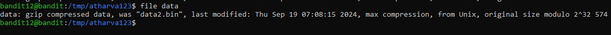

# Level 12 -> 13

Objective: The password for the next level is stored in the file data.txt, which is a hexdump of a file that has been repeatedly compressed. For this level it may be useful to create a directory under /tmp in which you can work. Use mkdir with a hard to guess directory name. Or better, use the command “mktemp -d”. Then copy the datafile using cp, and rename it using mv (read the manpages!)

1. ls data.txt file is present.

2. cat data.txt
OUTPUT: hexdump data.

3. mkdir - to make a directory
**mkdir /tmp/atharva123**

4. cp - to copy data.txt file into the directory.
**cp data.txt /tmp/atharva123**

5. changing directory to tmp
**cd /tmp/atharva123**

6. xxd - make a hexdump or do the reverse.
adding -r to revert.
**xxd -r data.txt > data**

7. file - to check the file type
file data 
 

    **gzip compressed data**

8. mv - to rename the filename
**mv data data.gz**

9. gzip - to compress and expand files.
**gzip -d data.gz**

Repeat the steps again 

a) check the filetype

b) rename the file

c) decompress it 

for bzip2 compressed data run the command: **bzip2 -d data.bz2**

for tar archive: **tar xf data.tar**

at last we get data: ASCII text

10. **cat data**

**Password:** FO5dwFsc0cbaIiH0h8J2eUks2vdTDwAn