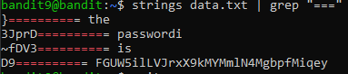

# Level 9->10 

Objective: The password for the next level is stored in the file data.txt in one of the few human-readable strings, preceded by several ‘=’ characters.

Command used: **_strings data.txt | grep "==="**

_**strings**_: finds and gives the strings in the file

_**grep "==="**_: finds the lines with "==="

2. response given is

    

Password: FGUW5ilLVJrxX9kMYMmlN4MgbpfMiqey